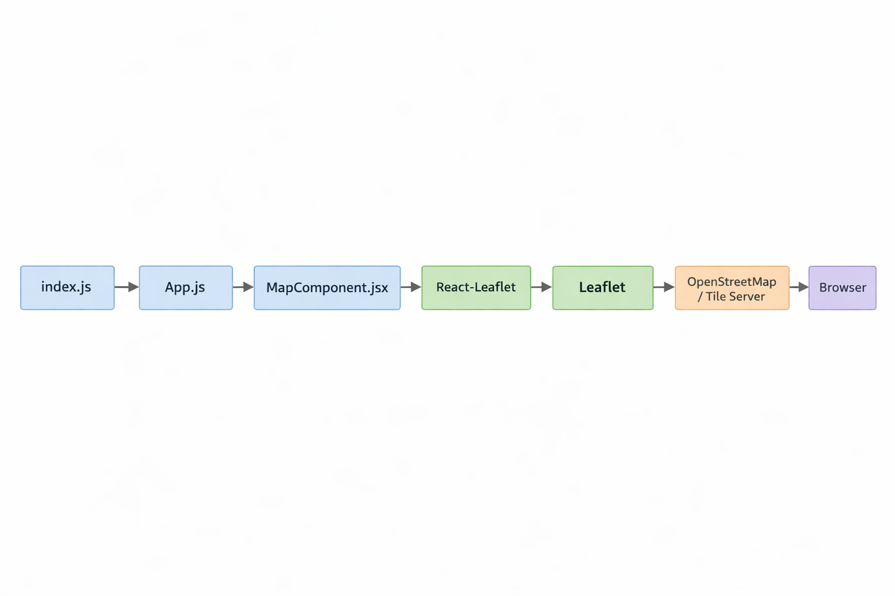

# 🍽️ Restaurant Map Simulator (rsim)

A modern full-stack React application for discovering and managing restaurants in Budapest, featuring interactive maps, API-powered data collection, and a fully functional admin panel.

---

## ✨ Features

### Core Features

* **Interactive Map (Leaflet)** – Explore restaurants on a responsive map with dynamic markers
* **Google Sheets Integration** – Load and sync restaurant data from external sheets
* **API-Based Restaurant Discovery** – Fetch restaurants dynamically using SerpAPI (Hunting system)
* **Restaurant List Panel** – View detailed restaurant information (address, rating, website)
* **Smart Search & Filtering** – Full-text search with category and source filtering
* **Favorites System** – Save favorite restaurants (stored in localStorage)
* **User Location Support** – Auto-detect and center map

---

## 📱 Mobile Responsiveness

* Fully responsive UI (mobile, tablet, desktop)
* Touch-friendly interactions
* Adaptive layout (map + list stacking)
* Optimized typography and spacing

---

## 🗺️ Map System

* Built with **Leaflet + OpenStreetMap**
* Color-coded markers:

  * 🔵 Sheet data
  * 🟠 API (Hunting)
  * 🟢 User location
  * 🔴 Selected restaurant
* Interactive popups with restaurant details

---

## 🔐 Admin Panel

* Password-protected access
* Session-based authentication (localStorage)
* Admin dashboard features:

  * Restaurant count statistics
  * Search & filtering
  * Source-based filtering (Sheet, Admin, API)

---

## 📊 Restaurant Management (CRUD)

* Add new restaurants
* Edit existing restaurants
* Delete restaurants
* Real-time updates in map and list

Editable fields:

* Name, address, category
* Coordinates (lat/lng)
* Website
* Rating

---

## 📈 Data Handling

* Multi-source merging (Sheet + API + Admin)
* Smart deduplication
* Data normalization
* Automatic website resolution

---

## 🚀 Quick Start

### Prerequisites

* Node.js (v14+)
* npm or yarn

### Installation

```bash
git clone https://github.com/yourusername/rasimo.git
cd rasimo
npm install
```

### Environment Variables

Create a `.env` file:

```env
# Admin
REACT_APP_ADMIN_PASSWORD=your_password

# Google Sheets
REACT_APP_GOOGLE_SHEETS_API_KEY=your_key

# SerpAPI (IMPORTANT)
SERPAPI_API_KEY=your_serpapi_key
```

---

### Run the App

```bash
# Backend
npm run server

# Frontend
npm start
```

App runs at:
👉 http://localhost:3000

---

## 📦 Project Structure

```
rasimo/
├── src/
│   ├── components/        # UI components
│   ├── utils/             # Data fetching & normalization
│   ├── App.js             # Main app logic
│   ├── AppRouter.jsx      # Routing
├── routes/                # API routes
├── services/              # Backend logic
├── server.js              # Express server
```

## 🏗️ Architecture Diagram


---

## 🧠 Key Features Explained

### 🔹 Hunting API (SerpAPI)

* Fetches real restaurant data dynamically
* Provides up to ~50 restaurants
* Includes location, ratings, and websites

### 🔹 Admin Panel Flow

1. Login with password
2. Add/edit restaurants
3. Changes reflect instantly in UI
4. Data persists via localStorage

---

## ⚠️ Notes

* Coordinates must match address to display correctly on map
* Admin data is stored locally (not in database)
* Restart backend after changing `.env`

---

## 🛠️ Available Scripts

```bash
npm start        # Run frontend
npm run server   # Run backend
npm run build    # Build for production
```

---

## 🌐 Browser Support

* Chrome / Edge / Firefox / Safari
* Mobile browsers supported

---

## 🚀 Deployment

* Vercel
* Netlify
* Any static hosting + Node backend

---

## 📄 License

MIT

---

## 👨‍💻 Author

Rasim

---
